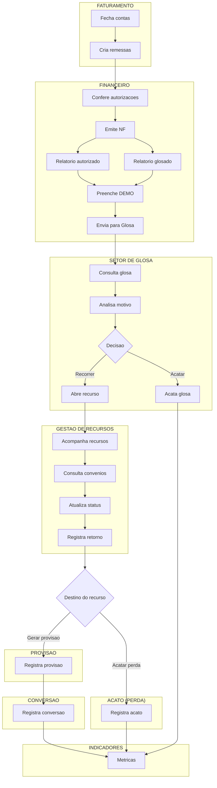

# Sistema de Gestao de Glosas Hospitalares

Plataforma corporativa para gerir o ciclo completo de glosas hospitalares a partir da conta faturada do ERP MV, consultada pela view Oracle `HPC_V_CONTA_ATENDIMENTO`.

## Arquitetura

```text
Oracle MV
  -> View HPC_V_CONTA_ATENDIMENTO
  -> API unica existente
  -> Django Frontend
```

## Regra fundamental

A origem do processo nao e a glosa. A origem e a conta hospitalar faturada. Toda glosa nasce de uma remessa, conta, atendimento ou item faturado retornado pela consulta Oracle.

## Como executar

Configure `API_BASE_URL` apontando para a API unica.

- Rodando Django direto no WSL: `API_BASE_URL=http://localhost:8000`
- Rodando o frontend em Docker: `API_BASE_URL=http://host.docker.internal:8000`

Se a API exigir autenticacao, informe um token Bearer:

```bash
export API_BEARER_TOKEN="seu-token"
```

Para a consulta de atendimento, o frontend usa por padrao a rota ja publicada na API atual:

```bash
API_CONTA_ATENDIMENTO_PATH=/app_glosas/
```

```bash
cp .env.example .env
docker compose up --build
```

Servicos:

- API unica: http://localhost:8000/docs
- Frontend Django: http://localhost:8080

## Modulos incluidos

- Consulta de contas/atendimentos via API unica
- Registro de glosas a partir da conta faturada
- Recursos
- Remessas
- Recebimentos financeiros
- Conciliacao e divergencias
- Dashboard de indicadores
- Historico/auditoria

## Endpoints esperados na API unica

- `GET /app_glosas/` com filtros `offset`, `limit`, `cd_remessa`, `cd_atendimento`, `cd_reg`, `nr_guia`, `cd_senha`, `nm_paciente`, `nm_convenio`, `descricao` e `tp_atendimento`
- `POST /app_glosas/glosas`
- `GET /glosas`
- `GET /glosas/{id}`
- `PATCH /glosas/{id}`
- `DELETE /glosas/{id}`
- `POST /recursos`
- `GET /recursos`
- `GET /recursos/{id}`
- `PATCH /recursos/{id}`
- `GET /remessas`
- `GET /remessas/{id}`
- `POST /remessas`
- `POST /recebimentos`
- `GET /recebimentos`
- `GET /recebimentos/{id}`
- `PATCH /recebimentos/{id}`
- `POST /conciliacao/executar`
- `GET /conciliacao/divergencias`
- `GET /dashboard/indicadores`
- `GET /glosas/{id}/historico`

## Decisoes de implementacao

- O Django nao consulta nem grava diretamente no PostgreSQL.
- O Django consome apenas a API HTTP configurada em `API_BASE_URL`.
- Nao ha upload de planilhas, pandas, openpyxl, ETL ou importadores.
- Os endpoints foram preparados no frontend como se ja existissem na API unica.

## Fluxo operacional de glosas


